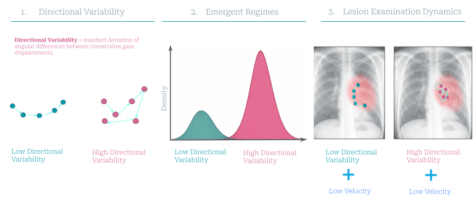

# Directional Dynamics Reveal Regimes of Human Visual Examination

## What is the problem?

When people examine complex images — like radiologists reading chest X-rays — their eyes move in rich, structured patterns. Yet the standard tools for measuring gaze only capture *how fast* and *how far* the eyes move: velocity, acceleration, saccade amplitude. These measures say nothing about how the *direction* of gaze changes from moment to moment. The result is that a fundamental geometric dimension of visual examination has gone unmeasured: does the viewer's gaze wander in a consistent direction, or does it change direction frequently within a short time window?

## What we did

We introduce **directional variability** — the standard deviation of the angular change between consecutive gaze displacement vectors, computed within short temporal windows (10–50 ms). Unlike velocity or step length, directional variability isolates changes in movement *orientation* independently of movement *magnitude*. We computed it across two large, independent datasets: REFLACX (3,052 radiograph interpretations by expert radiologists) and GazeBase (12,334 general viewing recordings across gaming, reading, and video tasks). We then tested whether directional variability reveals structured regime behavior that velocity and acceleration do not, and whether the composition of those regimes predicts meaningful downstream measures of how radiologists scan.

## What we found

Directional variability exhibits a **stable bimodal distribution** — two clearly separated modes — across all temporal scales tested and across both clinical and non-clinical viewing tasks. No other metric we tested (velocity, acceleration, step length variability) showed comparable mode separation; they produced asymmetric spike-plus-tail distributions instead. The two modes define **low-** and **high-directional-variability regimes** that correspond to directionally persistent transitions versus frequent local directional corrections, respectively. These regimes differ substantially in directional entropy and angular reversal density even after controlling for spatial extent, demonstrating that directional variability captures something beyond spatial spread. At the study level, the proportion of time spent in each regime provides incremental predictive value for scanpath topology metrics and time to report beyond comprehensive magnitude-based baselines, including velocity, acceleration, and mean turn angle.

---



*Directional variability is computed as the standard deviation of angular change between consecutive gaze displacement vectors within a short temporal window. Low directional variability reflects directionally persistent movement; high directional variability reflects frequent directional corrections. When computed across time, windowed directional variability yields a two-mode distribution, defining low- and high-variability regimes directly from the empirical density.*

---

## Repository

### Requirements

Python 3.9+ is recommended. Install dependencies with:

```bash
pip install numpy pandas scipy scikit-learn statsmodels matplotlib tqdm torch
```

| Package | Usage |
|---|---|
| `numpy` | Array operations throughout |
| `pandas` | Data loading and CSV I/O |
| `scipy` | Signal smoothing, GMM fitting, Mann-Whitney U, FDR correction |
| `scikit-learn` | Gaussian Mixture Model (`GaussianMixture`) |
| `statsmodels` | OLS regression, nested F-tests |
| `matplotlib` | Figure generation |
| `tqdm` | Progress bars |
| `torch` | Imported in `reflacxloader.py` |

### Dataset paths

All data paths are managed through a `paths.py` file that is **not included** in the repository (it is machine-specific). Create it at the root of the repository with the following structure:

```python
# paths.py
dataset_paths = {
    "reflacx": "/path/to/reflacx",   # root of the REFLACX dataset
    "gazebase": "/path/to/gazebase", # root of the GazeBase dataset
}
```

**REFLACX** is available at: https://physionet.org/content/reflacx-xray-localization/1.0.0/  
**GazeBase** is available at: https://figshare.com/articles/dataset/GazeBase_Data_Repository/12912257

The REFLACX root directory must contain a `jsons/` subdirectory with the following files (provided with the dataset): `transcripts.json`, `timestamps.json`, `abnormality_ellipses.json`, `img_dims.json`, `chest_bbs.json`.

### Output structure

All outputs are written to an `outputs/` directory created automatically at runtime:

```
outputs/
├── tables/          # CSV result tables
├── figures/         # PDF figures
└── cache/           # Precomputed window features (.npz / .npy)
```

Caching is used extensively. The first run over a dataset will be slow as features are computed and saved; subsequent runs load from cache.

---

### Scripts

#### Core infrastructure

**`gazebuilder.py`**  
Defines the `GazeWindow` dataclass and the `build_gaze_windows` function. A `GazeWindow` holds a sequence of gaze coordinates and timestamps for one temporal window, and exposes all per-window kinematic properties as lazy properties: displacement vectors, velocity, acceleration, step length, turn angles, spatial dispersion, and `compute_features()` which bundles the standard deviation of each into a dict. This is the computational foundation for every analysis in the repository.

**`reflacxloader.py`**  
Handles all data access for the REFLACX dataset. Loads the five JSON metadata files, iterates over patient–study pairs, reads per-study gaze CSVs, filters coordinates to the chest bounding box, segments gaze into temporal windows (with optional pre-reporting / reporting period filtering), and caches per-study window features as compressed `.npz` files. Also retrieves abnormality ellipse and anatomical region annotations per study.

**`gazebaseloader.py`**  
Handles all data access for the GazeBase dataset. Reads subject ZIP archives, maps game abbreviations to CSV filenames, converts gaze coordinates from degrees of visual angle to pixel space, builds gaze windows, and caches per-subject features. Supports pooled and per-subject metric aggregation across subjects and sessions, used for bimodality analysis and the Subject Variance Ratio computation.

**`stats_utils.py`**  
Shared statistical utilities used across all analysis scripts. Contains: `fit_gmm_2comp` (two-component Gaussian Mixture Model with data-driven valley initialization for `turn_std`), `compute_delta_bic` (ΔBIC comparing one- vs. two-component fits), `mw_stats` (Mann-Whitney U with rank biserial correlation), `finite` and `subsample` (array helpers), and `logpdf` / `rank01` (auxiliary functions).

**`utils.py`**  
Coordinate and spatial utilities. Defines the GazeBase screen geometry constants (pixel dimensions, physical dimensions, viewing distance) and `dva_to_pixels` for converting gaze coordinates from degrees of visual angle to pixel space. Also provides `filter_xy_to_rect`, `scale_xy`, `scale_rect`, and a `savefig` convenience wrapper.

**`local_annotations.py`**  
Dataclasses for REFLACX spatial annotations: `AbnormalityEllipse` (axis-aligned ellipse with label list, containment test, and mask generation) and `AnatomicalRegion` (rectangular bounding box with containment test and mask generation).

---

#### Analysis scripts

**`bimodality_reflacx.py`** → *Figure 2, REFLACX rows*  
Computes the pooled distribution of windowed directional variability, velocity variability, acceleration variability, and step length variability across all REFLACX studies for window sizes 10–50 ms. For each metric and window size, fits a two-component GMM, estimates the valley (regime boundary) between modes using Savitzky-Golay smoothing, and reports Cohen's *d*, ΔBIC, minimum mixture proportion, and tail-to-median ratio (p99/p50). Outputs one CSV table and one distribution plot per metric per window size.

```bash
python bimodality_reflacx.py
# → outputs/tables/reflacx_bimodality_quality.csv
# → outputs/figures/reflacx_distributions/
```

**`bimodality_gazebase.py`** → *Figure 2, GazeBase rows*  
Same bimodality analysis for GazeBase across Reading, Video_1, and Balura_Game tasks. Additionally computes the **Subject Variance Ratio (SVR)** — the fraction of total directional variability variance attributable to stable between-subject differences — to verify that bimodality is not an artifact of pooling heterogeneous observers.

```bash
python bimodality_gazebase.py
# → outputs/tables/gazebase_bimodality_quality.csv
# → outputs/figures/gazebase_distributions/
```

**`mode_intrep_reflacx.py`** → *Figure 3, REFLACX panel*  
Tests whether directional variability regimes reflect directional organization beyond spatial extent in REFLACX. For each window, computes directional entropy, angular reversal density, curved return rate, and curved crossing rate. Compares low vs. high variability regimes using median splits on directional variability, velocity, acceleration, and step length, reporting Cohen's *d* and rank biserial correlations. Repeats comparisons within spatial dispersion quartiles to control for spatial extent.

```bash
python mode_intrep_reflacx.py
# → outputs/tables/complexity_reflacx_absolute.csv
# → outputs/tables/complexity_reflacx_stratified.csv
# → outputs/tables/complexity_reflacx_summary.csv
```

**`mode_intrep_gazebase.py`** → *Figure 3, GazeBase panel*  
Same regime interpretation analysis for GazeBase across Reading, Video_1, and Balura_Game tasks. Imports metric computation functions directly from `mode_intrep_reflacx.py` to ensure identical operationalization across datasets.

```bash
python mode_intrep_gazebase.py
# → outputs/tables/complexity_gazebase_absolute.csv
# → outputs/tables/complexity_gazebase_stratified.csv
# → outputs/tables/complexity_gazebase_summary.csv
```

**`abnormality_complexity.py`** → *Figure 4*  
Study-level predictive analysis in REFLACX. For each study, computes the proportion of pre-reporting windows assigned to each of four directional × velocity regimes (HiF-LoV, HiF-HiV, LoF-LoV, LoF-HiV) using median splits. Fits nested OLS models M1 (mean velocity) → M2 (+magnitude variability) → M3 (+mean turn angle) → M4 (+regime proportions) for six outcomes: transition entropy, unique cells visited, self-loop fraction, stationary gaze entropy, determinism, and time to report. Reports ΔBIC, bootstrap 95% CIs for ΔR², Cohen's *f*², FDR-corrected p-values, and Spearman correlations. Runs across three window configurations (10/20/30 ms) for robustness.

```bash
python abnormality_complexity.py
# → outputs/tables/unified_validation_multiwindow.csv
```

---

### Recommended execution order

```
1. bimodality_reflacx.py        # produces valley estimates used downstream
2. bimodality_gazebase.py
3. mode_intrep_reflacx.py       # requires cached windows from step 1
4. mode_intrep_gazebase.py
5. abnormality_complexity.py    # study-level prediction; independent of steps 3–4
```

Steps 1 and 2 must complete before steps 3–5, as the valley estimates they produce are loaded by the downstream scripts to initialize regime boundaries.

---

